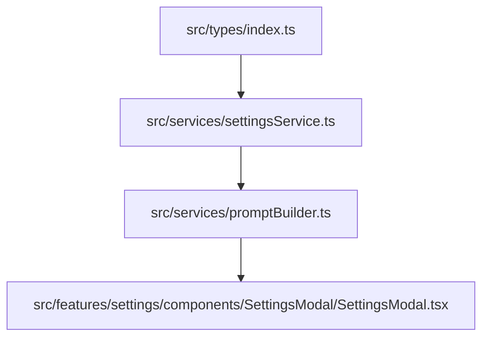

# Kế hoạch triển khai: Quản lý Prompt Chuyên Sâu theo TDD

Tài liệu này xác định kế hoạch triển khai tính năng **Quản lý Prompt Chuyên Sâu** (Advanced Prompt Management) theo triết lý **Test-Driven Development (TDD)**. Mỗi task được chia dọc (vertical slice) hoàn chỉnh từ khâu viết test lỗi (RED), viết code tối thiểu (GREEN) và dọn dẹp mã nguồn (REFACTOR).

---

## 1. Biểu đồ phụ thuộc (Dependency Graph)

Các thành phần được phát triển tuần tự theo thứ tự phụ thuộc dưới đây để đảm bảo tính sẵn sàng của tầng dữ liệu trước khi ghép UI:

---

## 2. Các pha triển khai theo phương pháp TDD

### Pha 1: Dữ liệu & Lưu trữ (Storage & Database)
*Mục tiêu: Đảm bảo cơ sở dữ liệu IndexedDB tự động nạp cấu hình prompt mặc định cho người dùng mới và di trú (migrate) an toàn cho người dùng cũ.*

#### Task 1.1: Viết test nạp mặc định (RED)
*   **Mục tiêu:** Viết kiểm thử mô phỏng `getSettings` khi cơ sở dữ liệu trống chưa có trường `prompts`. Test mong đợi trường `prompts` chứa 7 prompt hệ thống mặc định (`system_base`, `description`, `personality`, `scenario`, `examples`, `jailbreak`, `system_note`).
*   **File cần sửa/tạo:** [tests/settingsService.test.ts](file:///d:/Code/chat-ai/tests/settingsService.test.ts)
*   **Tiêu chí nghiệm thu (Acceptance Criteria):** Chạy `npx vitest tests/settingsService.test.ts` báo lỗi do chưa định nghĩa prompts mặc định.

#### Task 1.2: Triển khai Schema & Di trú Dữ liệu (GREEN)
*   **Mục tiêu:** 
    *   Cập nhật `Settings` interface trong [index.ts](file:///d:/Code/chat-ai/src/types/index.ts) hỗ trợ `prompts?: PromptConfig[]`.
    *   Khai báo danh sách `DEFAULT_PROMPTS` trong [settingsService.ts](file:///d:/Code/chat-ai/src/services/settingsService.ts).
    *   Cập nhật `getSettings` để merge `DEFAULT_PROMPTS` nếu IndexedDB chưa lưu dữ liệu prompts.
*   **File cần sửa:** [src/types/index.ts](file:///d:/Code/chat-ai/src/types/index.ts), [src/services/settingsService.ts](file:///d:/Code/chat-ai/src/services/settingsService.ts)
*   **Tiêu chí nghiệm thu:** Chạy `npx vitest tests/settingsService.test.ts` thành công (GREEN).

---

### Pha 2: Động cơ Prompt Builder (Assembly Engine)
*Mục tiêu: Hàm `buildChatMessages` lắp ráp động toàn bộ payload truyền lên AI dựa trên cấu hình độ sâu, thứ tự của các prompts đang bật.*

#### Task 2.1: Viết test cho thuật toán sắp xếp & chèn (RED)
*   **Mục tiêu:** 
    *   Viết test case `buildChatMessages` chèn các prompts hệ thống vào lịch sử chat theo đúng độ sâu chỉ định.
    *   Viết test case kiểm tra độ ưu tiên (`injectionOrder`) khi có 2 prompt chèn cùng độ sâu.
    *   Viết test case kiểm tra việc bỏ qua các prompt đã tắt (`enabled: false`).
*   **File cần sửa:** [tests/promptBuilder.test.ts](file:///d:/Code/chat-ai/tests/promptBuilder.test.ts)
*   **Tiêu chí nghiệm thu:** Chạy test mới báo lỗi (RED) do logic cũ đang dùng template hệ thống cứng.

#### Task 2.2: Viết test cho việc thay thế Placeholder (RED)
*   **Mục tiêu:** Viết test case xác minh các thẻ placeholder như `{{char}}`, `{{user}}`, `{{personality}}` được thay thế chính xác bằng nội dung tương ứng của Character card.
*   **File cần sửa:** [tests/promptBuilder.test.ts](file:///d:/Code/chat-ai/tests/promptBuilder.test.ts)
*   **Tiêu chí nghiệm thu:** Test báo lỗi (RED).

#### Task 2.3: Triển khai Prompt Builder động (GREEN)
*   **Mục tiêu:** 
    *   Viết hàm thay thế placeholder tổng quát cho mọi prompt.
    *   Refactor `buildChatMessages` để duyệt danh sách prompts, lọc các phần tử enabled, sort theo `depth` và `order`, tiến hành splice chèn vào đúng vị trí tương ứng của mảng tin nhắn.
*   **File cần sửa:** [src/services/promptBuilder.ts](file:///d:/Code/chat-ai/src/services/promptBuilder.ts)
*   **Tiêu chí nghiệm thu:** Chạy toàn bộ test suite trong `tests/promptBuilder.test.ts` báo GREEN.

---

### Pha 3: Giao diện quản lý (Settings & Prompt UI)
*Mục tiêu: Người dùng có thể bật/tắt, chỉnh sửa template, độ sâu/thứ tự và tự tạo prompt tùy chỉnh của mình.*

#### Task 3.1: Viết test tích hợp quản lý Prompts nháp (RED)
*   **Mục tiêu:** Viết test case mô phỏng người dùng chỉnh sửa prompt nháp trong Settings Modal, đảm bảo thay đổi chỉ được ghi xuống DB khi click nút **Lưu** và bị hủy bỏ khi click **Hủy**.
*   **File cần sửa:** [tests/settingsService.test.ts](file:///d:/Code/chat-ai/tests/settingsService.test.ts)
*   **Tiêu chí nghiệm thu:** Test báo lỗi (RED).

#### Task 3.2: Triển khai giao diện Tab & Danh sách Prompts (GREEN)
*   **Mục tiêu:** 
    *   Chuyển đổi giao diện `SettingsModal` thành cấu trúc Tab: "Cài đặt chung" và "Quản lý Prompt".
    *   Vẽ bảng danh sách hiển thị các prompts bao gồm công tắc bật/tắt (toggle), nút Edit/Reset/Delete.
*   **File cần sửa:** [SettingsModal.tsx](file:///d:/Code/chat-ai/src/features/settings/components/SettingsModal/SettingsModal.tsx), [SettingsModal.css](file:///d:/Code/chat-ai/src/features/settings/components/SettingsModal/SettingsModal.css)
*   **Tiêu chí nghiệm thu:** Component render danh sách prompt đầy đủ từ state nháp.

#### Task 3.3: Triển khai Form chỉnh sửa & Tạo prompt tùy chỉnh (GREEN)
*   **Mục tiêu:** 
    *   Tạo form chỉnh sửa prompt cho phép cập nhật: Tên, Vai trò, Độ sâu, Thứ tự, Nội dung.
    *   Bổ sung nút "Thêm Prompt tùy chỉnh" tự sinh UUID để người dùng thêm chỉ thị riêng.
*   **File cần sửa:** [SettingsModal.tsx](file:///d:/Code/chat-ai/src/features/settings/components/SettingsModal/SettingsModal.tsx)
*   **Tiêu chí nghiệm thu:** Người dùng có thể tạo, chỉnh sửa prompt và nhấn Lưu thành công ghi xuống IndexedDB. Mọi test case của Pha 3 chuyển sang GREEN.

---

## 3. Các điểm kiểm soát (Checkpoints)

*   **Checkpoint 1:** Sau Pha 1, dữ liệu IndexedDB phải lưu trữ và nạp đầy đủ 7 prompt hệ thống mặc định.
*   **Checkpoint 2:** Sau Pha 2, chạy `npx vitest` kiểm tra logic promptBuilder phải pass 100% không có lỗi hồi quy.
*   **Checkpoint 3:** Sau Pha 3, chạy build production thành công và xác minh thủ công luồng bật/tắt prompt, tùy chỉnh prompt chiến đấu giả tưởng hoạt động trơn tru.
